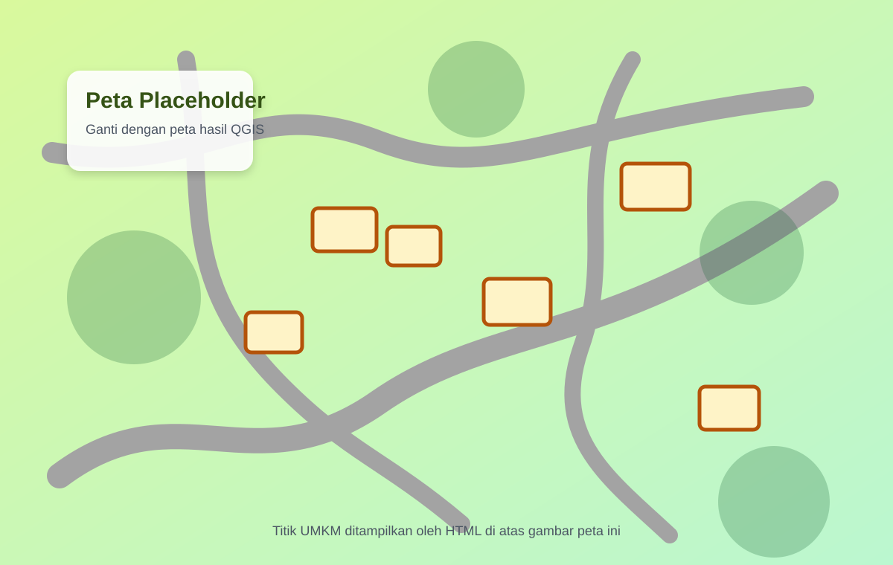

# Template Web Peta UMKM Pandai Besi

Template ini dibuat untuk web statis sederhana. Bisa langsung dibuka di browser dan bisa dideploy gratis ke GitHub Pages, Netlify, atau Vercel.

## Struktur File

```text
index.html
detail.html
style.css
script.js
detail.js
data.js
assets/img/
  peta-dusun-placeholder.svg
  umkm-placeholder.svg
  qr-placeholder.svg
```

## Cara Mengganti Data UMKM

Buka file `data.js`, lalu ubah data di dalam `dataUMKM`.

Bagian penting yang perlu diganti:

```javascript
namaUsaha
namaPemilik
lokasi
gmaps
foto
keunggulan
alat
produk
keterangan
posisiTop
posisiLeft
```

`posisiTop` dan `posisiLeft` digunakan untuk mengatur posisi titik UMKM di atas gambar peta.

Contoh:

```javascript
posisiTop: "42%",
posisiLeft: "55%"
```

## Cara Mengganti Peta

Ganti file:

```text
assets/img/peta-dusun-placeholder.svg
```

dengan peta final kamu dari QGIS atau desain lain.

Agar tidak perlu mengubah kode, nama filenya bisa dibuat sama:

```text
peta-dusun-placeholder.svg
```

Atau ubah bagian ini di `index.html`:

```html

```

## Cara Mengganti Foto UMKM

Masukkan foto ke folder:

```text
assets/img/
```

Lalu ubah bagian `foto` di `data.js`.

Contoh:

```javascript
foto: "assets/img/pandai-besi-pak-sardi.jpg"
```

## Cara Menghubungkan PDF Interaktif

Setelah web dideploy, link detail UMKM akan berbentuk seperti ini:

```text
https://username.github.io/nama-project/detail.html?id=1
https://username.github.io/nama-project/detail.html?id=2
```

Nanti link tersebut dipasang ke titik UMKM di PDF peta interaktif.
